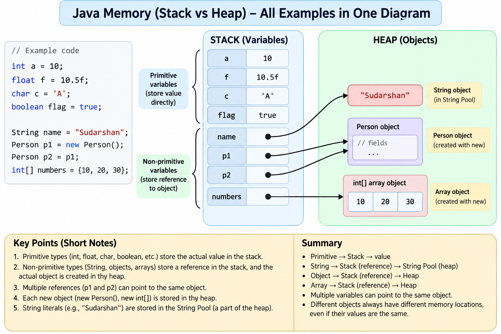

# Java Memory Management — Quick Notes

> Simple notes for understanding **Primitive vs Non-Primitive memory in Java**.

## Table of Contents

- [Basic Idea](#basic-idea)
- [Primitive Types](#primitive-types)
- [Non-Primitive Types](#non-primitive-types)
- [One Diagram — All Examples](#one-diagram--all-examples)
- [Same Value vs Same Object](#same-value-vs-same-object)
- [Quick Examples](#quick-examples)
- [Easy Rule to Remember](#easy-rule-to-remember)

---

## Basic Idea

For a simple learning model:

| Type | Variable stores | Object |
|---|---|---|
| **Primitive** | Actual value | No separate object |
| **Non-Primitive** | Reference | Object is generally in Heap |

> **Important:** Stack/Heap is a simplified learning model. The exact physical placement can depend on the JVM and JIT implementation.

---

## Primitive Types

Java has 8 primitive types:

```text
byte
short
int
long
float
double
char
boolean
```

### Main idea

```text
Primitive variable → actual value
```

Example:

```java
int a = 10;
float f = 10.5f;
char c = 'A';
boolean flag = true;
```

```text
STACK
┌─────────────┐
│ a = 10      │
│ f = 10.5    │
│ c = 'A'     │
│ flag = true │
└─────────────┘
```

---

## Non-Primitive Types

Examples:

```text
String
Array
Object / Class
Wrapper classes
```

The variable stores a **reference** to an object.

### String

```java
String name = "Sudarshan";
```

```text
STACK                    HEAP / STRING POOL

name ─────────────────►  "Sudarshan"
       reference
```

### Object

```java
Person p = new Person();
```

```text
STACK                    HEAP

p ────────────────────►  Person object
       reference
```

### Array

```java
int[] numbers = {10, 20, 30};
```

```text
STACK                    HEAP

numbers ──────────────►  [10, 20, 30]
         reference
```

---

## One Diagram — All Examples



This diagram combines:

- Primitive variables → store values
- `String` → reference to a String object
- Object → reference to an object
- Array → reference to an array object
- Multiple references → can point to the same object

---

## Same Value vs Same Object

### Primitive: same value

```java
int a = 10;
int b = 10;
int c = 10;
```

```text
STACK
┌─────────────┐
│ a = 10      │
│ b = 10      │
│ c = 10      │
└─────────────┘
```

`a`, `b`, and `c` are separate variables. Each contains the value `10`.

### Object: same reference

```java
Person p1 = new Person();
Person p2 = p1;
```

```text
STACK                    HEAP

p1 ───────────────────► Person Object
                         ▲
p2 ─────────────────────┘
```

`p1` and `p2` point to the **same object**.

### Object: different objects

```java
Person p1 = new Person();
Person p2 = new Person();
```

```text
STACK                    HEAP

p1 ───────────────────► Person Object 1

p2 ───────────────────► Person Object 2
```

These are two different objects.

---

## Quick Examples

### Primitive

```java
int age = 20;
```

```text
STACK
age = 20
```

**Stores:** value `20`

### String

```java
String name = "Sudarshan";
```

```text
STACK                    HEAP / STRING POOL

name ─────────────────► "Sudarshan"
```

**Stores:** reference

### Array

```java
int[] numbers = {10, 20, 30};
```

```text
STACK                    HEAP

numbers ──────────────► [10, 20, 30]
```

**Stores:** reference

### Object

```java
Person p = new Person();
```

```text
STACK                    HEAP

p ────────────────────► Person Object
```

**Stores:** reference

---

## Easy Rule to Remember

```text
PRIMITIVE
    ↓
Variable stores VALUE

NON-PRIMITIVE
    ↓
Variable stores REFERENCE
    ↓
Reference points to OBJECT
```

### One-line memory trick

> **Primitive → value**
>
> **String / Object / Array → reference → object**

---

## Important Small Notes

- `String` is a **reference type**, not a primitive.
- An array is also an **object** in Java.
- String literals such as `"Sudarshan"` are kept in the **String Pool**.
- `new Person()` creates an object.
- `new int[3]` creates an array object.
- `null` can be assigned to a reference variable, not to a primitive variable.
- `==` compares primitive values; for references, it checks whether the references point to the same object.
- `.equals()` is commonly used to compare logical/content equality.

---

## Final Cheat Sheet

| Example | Variable stores | Simple model |
|---|---|---|
| `int a = 10` | Value | Stack → `10` |
| `float f = 10.5f` | Value | Stack → `10.5` |
| `char c = 'A'` | Value | Stack → `'A'` |
| `boolean flag = true` | Value | Stack → `true` |
| `String name = "Sudarshan"` | Reference | Stack → String Pool |
| `Person p = new Person()` | Reference | Stack → Heap |
| `int[] numbers = {10,20,30}` | Reference | Stack → Heap |

### ⭐ Remember

```text
Primitive      = VALUE
Non-Primitive  = REFERENCE → OBJECT
```
