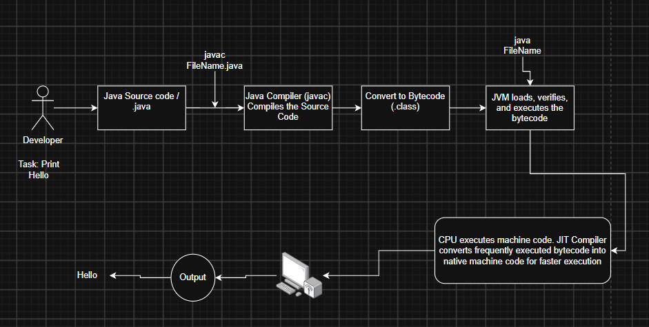
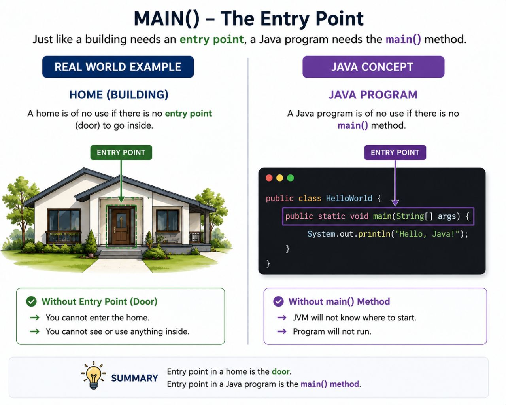

# 📘 My Java Backend Learning Journey

Hi! This repository is my daily learning log while I learn **Java** and backend development, under the mentorship of [Suresh Bishnoi](https://www.linkedin.com/in/bishnoisuresh/) Sir.

---

## 🗓️ Day 1 – Java Basics

I learned why Java is used so widely in the industry:

| Feature | What it means (in simple words) |
|---|---|
| ✅ Platform Independent | Java code runs on any OS (Windows, Mac, Linux) without changes, because of the JVM. |
| ✅ Object Oriented (OOPs) | We build programs using "objects" (like real-world things), which keeps code organized and reusable. |
| ✅ Automatic Garbage Collection | Java automatically removes unused objects from memory. We don't have to clean up manually. |
| ✅ Secure | Java doesn't allow direct memory access, which lowers the risk of harmful code. |
| ✅ JIT Compilation | The Just-In-Time compiler converts bytecode to machine code at run time, making programs faster. |
| ✅ Free to Use | Anyone can download and use Java without paying, which is why it's so widely adopted. |

I also wrote and successfully **compiled my first Java program**. Our instructor also told us to use **draw.io** to make architecture diagrams for every topic. This is helping me a lot — I understand concepts by *seeing* the flow, not just reading about it.

---

## 🗓️ Day 2 – How Java Works Internally

Today I learned the **full execution flow** of a Java program:

```
Java Source Code → Compiler → Bytecode → JVM → Output
```



I also practiced some basic rules:
- Every statement in Java ends with a **semicolon `;`**
- Java is **case-sensitive** (`Main` and `main` are different)

I solved some practice questions to make sure I understood these rules properly, and I made my own version of this diagram in draw.io.

I'm also uploading all my practice code to GitHub every day to stay consistent — something I already built as a habit during my JavaScript days, and now I'm carrying it into this Java/backend journey.

---

## 🗓️ Day 3 – Structure and Flow of a Java Program

Today I focused on understanding the **basic structure** of a Java program, especially the `main()` method.

### 🚪 The "Entry Point" Idea
Just like a house needs a door to enter, a Java program needs the **`main()`** method as the entry point — this is where the JVM starts running the code.



### 🛠️ Basic Development Flow
```
Requirement Understanding → Design → Development → Build (Compile) → Execute / Run & Test
```

As a practice example, I created an **`Account`** class to represent customer details (like in an SBI Net Banking example) and printed that information using Java.

### 🔑 New Concepts I Learned Today
- `public`, `private`, and `default` (access modifiers — who can use the code)
- **Identifiers** (the names we give to classes, methods, variables)
- `static` keyword (belongs to the class, not to a single object)
- `void` (method that doesn't return any value)
- `main()` (the entry point method)
- `String[] args` (used to pass values into the program from outside)

I wrote a small program combining all these concepts together, instead of just reading the theory — this made it much easier to understand.

---

# [How Java Memory Works with Primitive and Non-Primitive Types](Java%20Memory%20%28Stack%20Or%20Heap%29/README.md)
# [Static vs Dynamic](static-vs-dynamic/static.md)
---

⭐ *Consistency over perfection — one concept, one day at a time.*
