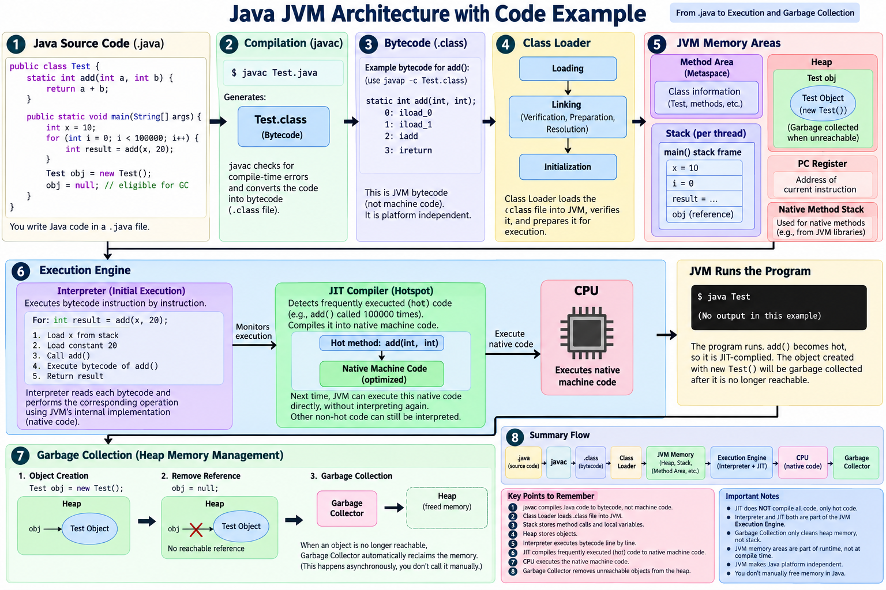

# Java JVM Architecture — Simple Notes

This README explains what happens to a Java program from the moment we
write `.java` code until the CPU executes it.

The main flow we are learning is:

``` text
Java Source Code
      ↓
    javac
      ↓
.class (Bytecode)
      ↓
  Class Loader
      ↓
      JVM
      ↓
 JVM Memory
      ↓
 Execution Engine
   ↙          ↘
Interpreter    JIT
   ↓            ↓
Execute       Native
bytecode       Code
   ↘            ↙
       CPU
        ↓
   Program runs

Heap
 ↓
Garbage Collector
 ↓
Unreachable objects removed
```

## Architecture Diagram

<figure>

<figcaption aria-hidden="true">Java JVM Architecture with Code
Example</figcaption>
</figure>

------------------------------------------------------------------------

# 1. Java Source Code

We first write Java code in a `.java` file.

Example:

``` java
public class Test {

    static int add(int a, int b) {
        return a + b;
    }

    public static void main(String[] args) {

        int x = 10;

        for (int i = 0; i < 100000; i++) {
            int result = add(x, 20);
        }
    }
}
```

File:

``` text
Test.java
```

------------------------------------------------------------------------

# 2. `javac` — Java Compiler

We compile the source code:

``` bash
javac Test.java
```

This creates:

``` text
Test.class
```

The `.class` file contains **Java bytecode**.

### Important

`javac` does **not** normally convert Java code directly into CPU
machine code.

``` text
.java
  ↓ javac
.class
  ↓
Bytecode
```

Bytecode is designed to be executed by the JVM.

------------------------------------------------------------------------

# 3. Class Loader

When we run:

``` bash
java Test
```

the JVM needs the `Test` class.

The **Class Loader** loads the required `.class` file into the JVM.

Simplified flow:

``` text
Test.class
    ↓
Class Loader
    ↓
JVM
```

The Class Loader is responsible for loading classes and interfaces and
preparing them for use by the JVM.

------------------------------------------------------------------------

# 4. JVM Memory

Once the program is running, the JVM uses different runtime memory
areas.

The three easiest areas to remember are:

``` text
Method Area / Metaspace
Heap
Stack
```

## Heap

The **Heap** is mainly where objects are created.

Example:

``` java
Test obj = new Test();
```

Conceptually:

``` text
Stack
┌──────────────┐
│ obj ─────────┼──────┐
└──────────────┘      │
                      ↓
                    Heap
               ┌────────────┐
               │ Test object│
               └────────────┘
```

Remember:

> **Heap → objects**

## Stack

Each thread has its own stack.

When a method is called, a **stack frame** is created for that method.

Example:

``` java
main()
```

Conceptually:

``` text
Stack
┌─────────────────┐
│ main() frame    │
│ x = 10          │
│ i = 0           │
│ result = ...    │
└─────────────────┘
```

Remember:

> **Stack → method execution + local variables**

When a method finishes, its stack frame is removed.

## Method Area / Metaspace

This area contains class-related runtime information.

For example:

``` text
Test class information
Methods
Fields
Runtime class metadata
```

For modern HotSpot JVMs, much of this class metadata is stored in
**Metaspace**.

------------------------------------------------------------------------

# 5. Execution Engine

After classes are loaded, the JVM has to execute the bytecode.

The **Execution Engine** is responsible for executing it.

The two important parts for our discussion are:

``` text
Execution Engine
       │
   ┌───┴────┐
   ↓        ↓
Interpreter JIT
```

------------------------------------------------------------------------

# 6. Interpreter

The Interpreter starts executing bytecode.

Think of it as:

``` text
Bytecode
   ↓
Interpreter
   ↓
Execute bytecode instructions
   ↓
Next instructions
   ↓
Execute
```

The important thing is:

> **The Interpreter does not first compile the entire application into
> native machine code. It executes bytecode at runtime.**

For example, if a method is called:

``` java
hello();
```

the interpreter can execute the bytecode for that method.

If it is called only once, there may be little benefit in spending time
compiling it with JIT.

------------------------------------------------------------------------

# 7. JIT Compiler

JIT means:

**Just-In-Time Compiler**

The JVM monitors code while the program is running.

Suppose:

``` java
for (int i = 0; i < 100000; i++) {
    add(10, 20);
}
```

The `add()` method is executed many times.

The JVM can recognize that this is **hot code**.

Then JIT can compile that frequently executed code into **native machine
code**.

``` text
Bytecode
   ↓
Interpreter initially executes
   ↓
JVM observes frequently executed code
   ↓
Hot code
   ↓
JIT Compiler
   ↓
Native Machine Code
   ↓
CPU
```

The compiled code can then be reused for later executions.

### Very important

JIT does **not** mean:

``` text
All Java code
     ↓
Machine code
```

Instead, the important idea is:

``` text
Frequently executed / hot code
            ↓
           JIT
            ↓
   Native machine code
```

Less frequently executed code can continue to be interpreted.

------------------------------------------------------------------------

# 8. Interpreter vs JIT

This is the easiest comparison:

| Interpreter                               | JIT                               |
|-------------------------------------------|-----------------------------------|
| Executes bytecode                         | Compiles hot bytecode             |
| Works during runtime                      | Works during runtime              |
| Does not need to compile everything first | Compiles frequently executed code |
| Good for starting execution quickly       | Helps improve performance         |
| Bytecode is interpreted                   | Native machine code can be reused |

Simple mental model:

``` text
Interpreter:

Bytecode
   ↓
Interpret
   ↓
Execute


JIT:

Hot Bytecode
   ↓
Compile
   ↓
Native Machine Code
   ↓
Execute
```

------------------------------------------------------------------------

# 9. How Does the CPU Understand It?

This was the confusing part.

The CPU ultimately executes **machine instructions**.

The Interpreter itself is implemented as native code inside the JVM.

So don’t think:

``` text
Bytecode
   ↓
Interpreter converts every line
   ↓
Machine code
```

as if the interpreter were a normal compiler.

A better mental model is:

``` text
Bytecode
   ↓
Interpreter
   ↓
JVM performs the required operations
   ↓
CPU executes the JVM's native instructions
```

With JIT:

``` text
Hot Bytecode
     ↓
    JIT
     ↓
Native Machine Code
     ↓
    CPU
```

This is why JIT can avoid repeatedly interpreting the same hot code.

------------------------------------------------------------------------

# 10. Garbage Collector

Java automatically manages Heap memory with the **Garbage Collector
(GC)**.

Example:

``` java
Test obj = new Test();

obj = null;
```

Initially:

``` text
Stack                    Heap

obj ──────────────────→ Test object
```

After:

``` java
obj = null;
```

the object may become unreachable:

``` text
Stack                    Heap

obj = null             Test object
                         ↑
                   no reachable reference
```

The Garbage Collector can eventually reclaim the memory occupied by
unreachable objects.

``` text
Unreachable object
       ↓
Garbage Collector
       ↓
Memory reclaimed
       ↓
Heap can reuse the memory
```

### Important

You do not manually call:

``` text
free(object)
```

like in languages with manual memory management.

Java’s GC handles object-memory reclamation automatically.

Also:

> GC mainly deals with unreachable objects in the Heap. A method’s Stack
> frame normally disappears when that method returns.

------------------------------------------------------------------------

# 11. Complete Example

Consider:

``` java
public class Test {

    static int add(int a, int b) {
        return a + b;
    }

    public static void main(String[] args) {

        int x = 10;

        for (int i = 0; i < 100000; i++) {
            int result = add(x, 20);
        }

        Test obj = new Test();
        obj = null;
    }
}
```

Now follow the program:

``` text
1. Test.java
      ↓
2. javac
      ↓
3. Test.class (bytecode)
      ↓
4. Class Loader loads Test
      ↓
5. JVM creates/uses runtime memory
      ↓
6. main() starts
      ↓
7. main() gets a Stack Frame
      ↓
8. add() starts executing
      ↓
9. Interpreter executes bytecode
      ↓
10. add() is called many times
      ↓
11. JVM identifies add() as hot code
      ↓
12. JIT compiles hot code to native machine code
      ↓
13. JVM can use the compiled code for later executions
      ↓
14. CPU executes the native instructions
      ↓
15. Test object is created on the Heap
      ↓
16. obj = null
      ↓
17. Object becomes unreachable
      ↓
18. Garbage Collector can reclaim its Heap memory
```

------------------------------------------------------------------------

# 12. The Mental Model

If you remember only one diagram, remember this:

``` text
                 Test.java
                    │
                    │ javac
                    ▼
              Test.class
               Bytecode
                    │
                    ▼
              Class Loader
                    │
                    ▼
                   JVM
                    │
          ┌─────────┴─────────┐
          │                   │
       JVM Memory       Execution Engine
          │                   │
     ┌────┼────┐         ┌────┴────┐
     │    │    │         │         │
    Heap Stack Method   Interpreter JIT
         Area           │         │
                       │      Hot Code
                       │         │
                       │    Native Code
                       │         │
                       └────┬────┘
                            ▼
                           CPU
                            │
                            ▼
                       Program Runs

        Heap
          │
          ▼
   Unreachable Objects
          │
          ▼
  Garbage Collector
          │
          ▼
    Memory Reclaimed
```

------------------------------------------------------------------------

# Quick Revision

``` text
javac
  ↓
.java → .class (bytecode)

Class Loader
  ↓
Loads classes into JVM

Heap
  ↓
Objects

Stack
  ↓
Method calls + local variables

Interpreter
  ↓
Executes bytecode

JIT
  ↓
Compiles frequently executed/hot code
into native machine code

CPU
  ↓
Executes machine instructions

Garbage Collector
  ↓
Reclaims memory of unreachable Heap objects
```

## One-line summary

> **Java source is compiled into bytecode, the JVM loads it and starts
> execution through the Execution Engine; the Interpreter executes
> bytecode, while JIT can compile hot code into native machine code for
> faster repeated execution, and Garbage Collection reclaims unreachable
> Heap objects.**
